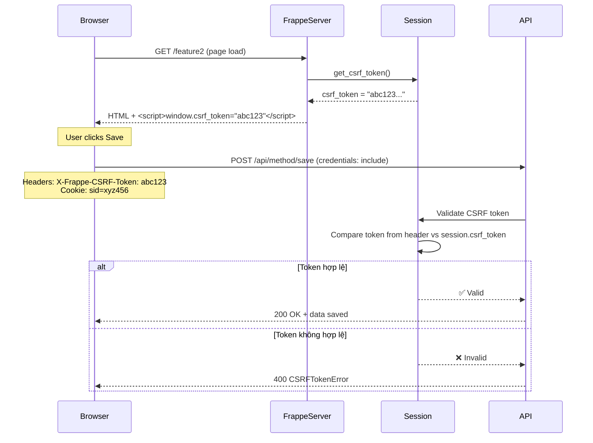

# Fix Lỗi CSRF Token khi gọi API từ Vue Frontend

## 📋 Mục lục

1. [Tổng quan](#tổng-quan)
2. [Triệu chứng lỗi](#triệu-chứng-lỗi)
3. [Nguyên nhân gốc rễ](#nguyên-nhân-gốc-rễ)
4. [Cơ chế CSRF Token trong Frappe](#cơ-chế-csrf-token-trong-frappe)
5. [Giải pháp chi tiết](#giải-pháp-chi-tiết)
6. [Code mẫu](#code-mẫu)
7. [Kiểm tra và Debug](#kiểm-tra-và-debug)
8. [Best Practices](#best-practices)

---

## Tổng quan

**Lỗi:** `CSRFTokenError: Invalid Request` (HTTP 400 Bad Request)  
**Khi nào xảy ra:** Gọi API POST/PUT/DELETE từ Vue frontend  
**Ảnh hưởng:** Không thể lưu dữ liệu vào database  
**Mức độ:** 🔴 Critical  

---

## Triệu chứng lỗi

### 1. Console Error
```javascript
POST http://testclone.test:8001/api/method/custom_app.customdemo.doctype.balance_sheet.balance_sheet.save_balance_sheet 400 (BAD REQUEST)

Save Balance Sheet failed: 
{
  exception: 'frappe.exceptions.CSRFTokenError: Invalid Request',
  exc_type: 'CSRFTokenError',
  exc: '["Traceback (most recent call last):\\n  File \\"apps/frappe/frappe/app.py\\", line 105, in application\\n    init_request(request)\\n  File \\"apps/frappe/frappe/app.py\\", line 200, in init_request\\n    frappe.local.http_request = HTTPRequest()\\n  File \\"apps/frappe/frappe/auth.py\\", line 50, in __init__\\n    self.validate_csrf_token()\\n  File \\"apps/frappe/frappe/auth.py\\", line 98, in validate_csrf_token\\n    frappe.throw(_(\\"Invalid Request\\"), frappe.CSRFTokenError)"]'
}
```

### 2. Network Tab
**Request Headers:**
```
X-Frappe-CSRF-Token: (empty hoặc sai giá trị)
Cookie: (không có sid)
```

**Response:**
```json
{
  "exception": "frappe.exceptions.CSRFTokenError: Invalid Request",
  "_server_messages": "[{\"message\": \"Invalid Request\", \"title\": \"Message\", \"indicator\": \"red\"}]"
}
```

---

## Nguyên nhân gốc rễ

### 1. ❌ Custom pages không inject CSRF token

**Vấn đề:** 
- Frappe pages mặc định (`/app`) tự động inject CSRF token qua `app.html`
- Custom pages (`/feature1`, `/feature2`) KHÔNG có logic inject token
- Result: `window.csrf_token` và `window.frappe.csrf_token` = undefined

**Code gốc (SAI):**
```python
# custom_app/www/feature2.py
def get_context(context):
    context.no_cache = 1
    context.show_sidebar = False
    # ❌ THIẾU: context.csrf_token = frappe.sessions.get_csrf_token()
    return context
```

```html
<!-- custom_app/www/feature2.html -->

<!-- ❌ THIẾU: inject CSRF token vào window -->
<script src="/assets/custom_app/frontend/js/main.js"></script>

```

### 2. ❌ Fetch requests thiếu `credentials: 'include'`

**Vấn đề:**
- Mặc định `fetch()` không gửi cookies (bao gồm session cookie `sid`)
- Backend Frappe cần `sid` cookie để lấy session và validate CSRF token
- Result: Backend không thể xác thực session → CSRF validation fail

**Code gốc (SAI):**
```javascript
// BalanceSheet.vue
fetch('/api/method/...', {
    method: 'POST',
    headers: {
        'X-Frappe-CSRF-Token': window.csrf_token || ''  // undefined!
    }
    // ❌ THIẾU: credentials: 'include'
})
```

### 3. ❌ Không có fallback mechanism

**Vấn đề:**
- Chỉ dựa vào `window.csrf_token` duy nhất
- Nếu page load trước khi token được set → lỗi vĩnh viễn
- Không có cách lấy token từ cookies hoặc `window.frappe`

---

## Cơ chế CSRF Token trong Frappe

### Flow hoạt động chuẩn



### Code validation trong Frappe

**File:** `apps/frappe/frappe/auth.py`

```python
def validate_csrf_token(self):
    if (
        not frappe.request
        or frappe.request.method not in UNSAFE_HTTP_METHODS  # POST, PUT, DELETE, PATCH
        or frappe.conf.ignore_csrf
        or not frappe.session
        or not (saved_token := frappe.session.data.csrf_token)  # Token từ session
        or (
            (frappe.get_request_header("X-Frappe-CSRF-Token") or frappe.form_dict.pop("csrf_token", None))
            == saved_token  # So sánh token từ header với session
        )
    ):
        return

    frappe.flags.disable_traceback = True
    frappe.throw(_("Invalid Request"), frappe.CSRFTokenError)  # ← LỖI XẢY RA Ở ĐÂY
```

**Điều kiện để pass CSRF validation:**
1. ✅ Request method là GET/HEAD/OPTIONS (safe methods), HOẶC
2. ✅ `frappe.conf.ignore_csrf = True` (dev mode), HOẶC
3. ✅ Token từ header `X-Frappe-CSRF-Token` === `frappe.session.data.csrf_token`

**Điều kiện để FAIL:**
- ❌ Token từ header khác với session token
- ❌ Token từ header = empty/None
- ❌ Session không tồn tại (do thiếu cookie `sid`)

---

## Giải pháp chi tiết

### Bước 1: Inject CSRF token vào Backend Context

**Tạo/Cập nhật file `.py` cho mỗi custom page:**

```python
# custom_app/www/feature1.py
# custom_app/www/feature1_edit.py
# custom_app/www/feature2.py
# custom_app/www/vue_demo.py

import frappe

def get_context(context):
    context.no_cache = 1
    context.show_sidebar = False
    
    # ✅ Inject CSRF token vào context
    context.csrf_token = frappe.sessions.get_csrf_token()
    
    return context
```

**Giải thích:**
- `frappe.sessions.get_csrf_token()` lấy hoặc tạo mới CSRF token cho session hiện tại
- Token này được lưu vào `frappe.session.data.csrf_token`
- Truyền vào `context` để Jinja template có thể truy cập qua `{{ csrf_token }}`

### Bước 2: Inject CSRF token vào Frontend (HTML)

**Cập nhật tất cả file `.html` trong `www/`:**

```html
<!-- custom_app/www/feature1.html -->
<!-- custom_app/www/feature1_edit.html -->
<!-- custom_app/www/feature2.html -->
<!-- custom_app/www/vue_demo.html -->



{{ _("Page Title") }}


<div id="vue-app"></div>



<link rel="stylesheet" href="/assets/custom_app/frontend/assets/main.css">



<script>
    // ✅ Inject CSRF token vào window object
    window.csrf_token = "{{ csrf_token }}";
    
    // ✅ Đảm bảo window.frappe tồn tại
    if (typeof window.frappe === 'undefined') {
        window.frappe = {};
    }
    window.frappe.csrf_token = "{{ csrf_token }}";
    
    console.log('[Page] CSRF Token injected:', window.csrf_token ? 'Yes' : 'No');
</script>
<script src="/assets/custom_app/frontend/js/main.js"></script>

```

**Giải thích:**
- Jinja template render `{{ csrf_token }}` thành giá trị thực tế (vd: "abc123xyz...")
- Set vào cả `window.csrf_token` và `window.frappe.csrf_token` để tương thích nhiều cách truy cập
- Script này chạy TRƯỚC `main.js` → đảm bảo token có sẵn khi Vue app mount

### Bước 3: Tạo Helper Function lấy CSRF Token

**File:** `custom_app/frontend/src/main.js`

```javascript
import { createApp } from 'vue';
import App from './App.vue';

if (typeof window !== 'undefined') {
    // ✅ Helper function: Lấy CSRF token từ nhiều nguồn
    window.getCSRFToken = function() {
        // Ưu tiên 1: window.frappe.csrf_token (chuẩn Frappe)
        if (window.frappe && window.frappe.csrf_token) {
            return window.frappe.csrf_token;
        }
        
        // Ưu tiên 2: window.csrf_token (legacy/custom)
        if (window.csrf_token) {
            return window.csrf_token;
        }
        
        // Ưu tiên 3: Đọc từ cookie 'csrf_token'
        const cookies = document.cookie.split(';');
        for (let cookie of cookies) {
            const [key, value] = cookie.trim().split('=');
            if (key === 'csrf_token') {
                return decodeURIComponent(value);
            }
        }
        
        console.warn('[custom_app] CSRF token not found!');
        return '';
    };
    
    console.log('[custom_app] getCSRFToken helper registered');
}

// ... rest of main.js
```

**Giải thích:**
- Function này cung cấp fallback mechanism 3 cấp
- Tránh hard-code `window.csrf_token` → dễ mở rộng trong tương lai
- Log warning khi không tìm thấy token → dễ debug

### Bước 4: Cập nhật tất cả Fetch Requests

**File:** `custom_app/frontend/src/components/BalanceSheet.vue`

**TRƯỚC (SAI):**
```javascript
async saveChanges() {
    const jsonData = { /* ... */ };
    
    try {
        const response = await fetch('/api/method/custom_app.customdemo.doctype.balance_sheet.balance_sheet.save_balance_sheet', {
            method: 'POST',
            headers: {
                'Content-Type': 'application/json',
                'X-Frappe-CSRF-Token': window.csrf_token || '',  // ❌ undefined!
            },
            // ❌ THIẾU credentials
            body: JSON.stringify({ payload: JSON.stringify(jsonData) }),
        });
        // ...
    } catch (err) {
        console.error('Error:', err);
    }
}
```

**SAU (ĐÚNG):**
```javascript
async saveChanges() {
    const jsonData = { /* ... */ };
    
    try {
        // ✅ Lấy CSRF token qua helper function
        const csrfToken = window.getCSRFToken ? window.getCSRFToken() : (window.csrf_token || '');
        
        const response = await fetch('/api/method/custom_app.customdemo.doctype.balance_sheet.balance_sheet.save_balance_sheet', {
            method: 'POST',
            headers: {
                'Content-Type': 'application/json',
                'X-Frappe-CSRF-Token': csrfToken,  // ✅ Token hợp lệ
            },
            credentials: 'include',  // ✅ GỬI SESSION COOKIE
            body: JSON.stringify({ payload: JSON.stringify(jsonData) }),
        });
        
        const data = await response.json();
        
        if (!(response.ok && data.message && data.message.success)) {
            console.error('Save Balance Sheet failed:', data);
            alert('Lưu thất bại. Vui lòng xem Console/Network.');
        } else {
            alert(`Đã lưu thành công!\n\nDocname: ${data.message.name}`);
        }
    } catch (err) {
        console.error('Error calling save_balance_sheet API:', err);
        alert('Lỗi khi gọi API lưu DB.');
    }
}
```

**Áp dụng tương tự cho:**
- `BalanceSheet.vue`: 
  - `saveChanges()` - POST save_balance_sheet
  - `loadBalanceSheet()` - GET get_balance_sheet_by_filters
- `CustomerList.vue`:
  - `loadCustomers()` - POST get_customers
  - `handleSubmit()` - POST create_customer
  - `handleDelete()` - POST delete_customer
- `CustomerEdit.vue`:
  - `loadCustomer()` - POST get_customer
  - `handleSubmit()` - POST update_customer

**Giải thích `credentials: 'include'`:**
- Mặc định `fetch()` không gửi cookies đến same-origin requests
- `credentials: 'include'` bắt browser gửi cookies (bao gồm `sid`)
- Backend Frappe cần `sid` cookie để:
  1. Xác định session của user
  2. Lấy `frappe.session.data.csrf_token` để validate
  3. Check permissions

### Bước 5: Build và Deploy

```bash
cd frappe-test
bench build --app custom_app
bench --site testclone.test clear-cache
bench restart
```

---

## Code mẫu

### Template đầy đủ cho Custom Page

**File:** `custom_app/www/my_custom_page.py`
```python
import frappe

def get_context(context):
    # No cache để đảm bảo token luôn mới
    context.no_cache = 1
    context.show_sidebar = False
    
    # Inject CSRF token
    context.csrf_token = frappe.sessions.get_csrf_token()
    
    # Custom data nếu cần
    context.page_title = "My Custom Page"
    context.custom_data = get_custom_data()
    
    return context

def get_custom_data():
    # Fetch data từ database nếu cần
    return {}
```

**File:** `custom_app/www/my_custom_page.html`
```html


{{ _(page_title or "Custom Page") }}


<div id="vue-app"></div>



<link rel="stylesheet" href="/assets/custom_app/frontend/assets/main.css">



<script>
    // Inject CSRF token
    window.csrf_token = "{{ csrf_token }}";
    if (typeof window.frappe === 'undefined') {
        window.frappe = {};
    }
    window.frappe.csrf_token = "{{ csrf_token }}";
    
    // Inject custom data nếu cần
    window.customPageData = {{ custom_data | tojson }};
    
    console.log('[MyCustomPage] Token:', window.csrf_token ? 'OK' : 'Missing');
</script>
<script src="/assets/custom_app/frontend/js/main.js"></script>

```

### Vue Component Template

```vue
<template>
  <div>
    <button @click="saveData">Save</button>
  </div>
</template>

<script>
export default {
  name: 'MyComponent',
  methods: {
    async saveData() {
      // ✅ Best practice: Lấy token ngay trước khi gọi API
      const csrfToken = window.getCSRFToken ? window.getCSRFToken() : (window.csrf_token || '');
      
      if (!csrfToken) {
        console.error('CSRF token not found! Cannot make API call.');
        alert('Lỗi: Không tìm thấy CSRF token. Vui lòng refresh page.');
        return;
      }
      
      try {
        const response = await fetch('/api/method/custom_app.my_module.my_api_method', {
          method: 'POST',
          headers: {
            'Content-Type': 'application/json',
            'X-Frappe-CSRF-Token': csrfToken,
          },
          credentials: 'include',  // Quan trọng!
          body: JSON.stringify({
            data: { /* your data */ }
          }),
        });
        
        if (!response.ok) {
          const error = await response.json();
          console.error('API Error:', error);
          throw new Error(error.exception || 'API call failed');
        }
        
        const result = await response.json();
        console.log('Success:', result);
        
        // Handle success
        if (result.message && result.message.success) {
          alert('Saved successfully!');
        }
      } catch (err) {
        console.error('Error:', err);
        alert('Error: ' + err.message);
      }
    }
  }
};
</script>
```

---

## Kiểm tra và Debug

### Checklist sau khi implement

- [ ] **Backend:** File `.py` có `context.csrf_token = frappe.sessions.get_csrf_token()`
- [ ] **Frontend HTML:** Template có inject `window.csrf_token` và `window.frappe.csrf_token`
- [ ] **Frontend JS:** Helper `window.getCSRFToken()` tồn tại
- [ ] **Vue Components:** Tất cả fetch POST/PUT/DELETE có `credentials: 'include'`
- [ ] **Vue Components:** Tất cả fetch có header `X-Frappe-CSRF-Token`
- [ ] **Build:** Chạy `bench build --app custom_app` thành công
- [ ] **Clear cache:** Chạy `bench --site <site> clear-cache`

### Debug trong Browser

**1. Kiểm tra CSRF token có được inject:**

```javascript
// Mở Console (F12)
console.log('window.csrf_token:', window.csrf_token);
console.log('window.frappe.csrf_token:', window.frappe?.csrf_token);
console.log('getCSRFToken():', window.getCSRFToken?.());
```

**Expected output:**
```
window.csrf_token: "1a2b3c4d5e6f7g8h9i0j..."
window.frappe.csrf_token: "1a2b3c4d5e6f7g8h9i0j..."
getCSRFToken(): "1a2b3c4d5e6f7g8h9i0j..."
```

**2. Kiểm tra cookies:**

```javascript
// Console
console.log('Cookies:', document.cookie);

// Hoặc trong Application tab → Cookies → <your-domain>
// Tìm cookie "sid" → phải có giá trị (session ID)
```

**3. Kiểm tra Network request:**

- Mở **Network tab** (F12)
- Trigger một API call (vd: Save button)
- Click vào request → **Headers tab**

**Request Headers phải có:**
```
X-Frappe-CSRF-Token: 1a2b3c4d5e6f7g8h9i0j...
Cookie: sid=xyz123...; csrf_token=1a2b3c4d5e6f7g8h9i0j...
Content-Type: application/json
```

**Response:**
- ✅ Status: `200 OK`
- ❌ Status: `400 Bad Request` → Vẫn còn lỗi, xem Response body

### Debug trong Backend

**1. Check session có CSRF token:**

```bash
cd frappe-test
bench --site testclone.test console
```

```python
import frappe
frappe.connect()
frappe.set_user("Administrator")

# Check CSRF token trong session
print("Session user:", frappe.session.user)
print("Session data:", frappe.session.data)
print("CSRF token:", frappe.session.data.get('csrf_token'))
```

**2. Enable debug mode để xem traceback đầy đủ:**

```bash
# site_config.json
{
  "developer_mode": 1,
  "ignore_csrf": 0
}
```

**3. Tạm thời disable CSRF để test (CHỈ DEV):**

```bash
# site_config.json
{
  "ignore_csrf": 1  # ⚠️ KHÔNG BAO GIỜ dùng trên PRODUCTION!
}
```

### Common Errors và Fix

| Lỗi | Nguyên nhân | Fix |
|-----|-------------|-----|
| `window.csrf_token is undefined` | Page `.py` không inject token | Thêm `context.csrf_token = frappe.sessions.get_csrf_token()` |
| `X-Frappe-CSRF-Token header is empty` | Frontend không lấy được token | Check HTML có `<script>window.csrf_token="{{csrf_token}}"</script>` |
| `Token không match` | Token cũ (cached) | Clear cache: `bench --site <site> clear-cache` |
| `Session expired` | Cookie `sid` bị xóa/expire | Login lại |
| `credentials: 'include' không work` | CORS issue (khác domain) | Check `site_config.json` có `allow_cors: "*"` (dev only) |

---

## Best Practices

### 1. ✅ Luôn validate token trước khi gọi API

```javascript
async callAPI() {
    const token = window.getCSRFToken?.();
    
    if (!token) {
        console.error('No CSRF token available');
        alert('Session expired. Please refresh the page.');
        return;
    }
    
    // Proceed with API call...
}
```

### 2. ✅ Centralize API calls vào service layer

**File:** `custom_app/frontend/src/services/api.js`

```javascript
export async function callFrappeAPI(method, data = {}) {
    const csrfToken = window.getCSRFToken?.() || window.csrf_token || '';
    
    if (!csrfToken) {
        throw new Error('CSRF token not found. Please refresh the page.');
    }
    
    const response = await fetch(`/api/method/${method}`, {
        method: 'POST',
        headers: {
            'Content-Type': 'application/json',
            'X-Frappe-CSRF-Token': csrfToken,
        },
        credentials: 'include',
        body: JSON.stringify(data),
    });
    
    if (!response.ok) {
        const error = await response.json();
        throw new Error(error.exception || `API call failed: ${response.statusText}`);
    }
    
    return await response.json();
}

// Usage trong component:
import { callFrappeAPI } from '@/services/api';

async saveData() {
    try {
        const result = await callFrappeAPI('custom_app.api.save_data', {
            data: this.formData
        });
        console.log('Success:', result);
    } catch (err) {
        console.error('Error:', err);
        alert('Error: ' + err.message);
    }
}
```

### 3. ✅ Handle session expiry gracefully

```javascript
async callAPI() {
    try {
        const response = await fetch(url, options);
        
        if (response.status === 403 && response.json().exc_type === 'SessionExpired') {
            alert('Session expired. Redirecting to login...');
            window.location.href = '/login?redirect-to=' + window.location.pathname;
            return;
        }
        
        // Handle response...
    } catch (err) {
        console.error(err);
    }
}
```

### 4. ✅ Sử dụng Frappe's frappe.call() (Alternative)

Nếu đang dùng Frappe's frontend framework:

```javascript
frappe.call({
    method: 'custom_app.api.save_data',
    args: {
        data: formData
    },
    callback: function(r) {
        if (r.message && r.message.success) {
            console.log('Success:', r.message);
        }
    },
    error: function(err) {
        console.error('Error:', err);
    }
});
```

**Ưu điểm:**
- Tự động xử lý CSRF token
- Tự động xử lý credentials
- Tự động parse response
- Built-in error handling

**Nhược điểm:**
- Phụ thuộc vào Frappe's JS framework
- Không dùng được với pure Vue/React apps

### 5. ❌ KHÔNG BAO GIỜ làm những điều này

```javascript
// ❌ KHÔNG hard-code CSRF token
const CSRF_TOKEN = "abc123xyz...";

// ❌ KHÔNG disable CSRF trên production
{
  "ignore_csrf": 1  // NGUY HIỂM!
}

// ❌ KHÔNG skip credentials
fetch(url, {
    // credentials: 'include'  // ← THIẾU = LỖI!
})

// ❌ KHÔNG cache token quá lâu
localStorage.setItem('csrf_token', token);  // Token có thể expire!

// ❌ KHÔNG expose token trong URL
fetch(`/api/method/save?csrf_token=${token}`);  // Dễ bị XSS!
```

---

## Tổng kết

### Các bước quan trọng nhất

1. **Backend inject token:** `context.csrf_token = frappe.sessions.get_csrf_token()`
2. **Frontend inject token:** `<script>window.csrf_token="{{csrf_token}}"</script>`
3. **Helper function:** `window.getCSRFToken()` với fallback mechanism
4. **Fetch với credentials:** `credentials: 'include'` trong mọi POST/PUT/DELETE
5. **Header chính xác:** `'X-Frappe-CSRF-Token': csrfToken`

### Khi nào cần làm gì

| Khi... | Cần kiểm tra/làm... |
|--------|---------------------|
| Tạo custom page mới | Tạo `.py` file với `context.csrf_token` |
| Thêm API call mới | Dùng `window.getCSRFToken()` + `credentials: 'include'` |
| Gặp lỗi 400 CSRF | Check Network tab → headers + cookies |
| Deploy lên production | Đảm bảo `ignore_csrf: 0` trong site_config |
| User báo "session expired" | Check session expiry settings trong System Settings |

### Resources

- [Frappe CSRF Documentation](https://frappeframework.com/docs/user/en/api/rest)
- [MDN: Fetch API credentials](https://developer.mozilla.org/en-US/docs/Web/API/Fetch_API/Using_Fetch#sending_a_request_with_credentials_included)
- [OWASP CSRF Prevention](https://cheatsheetseries.owasp.org/cheatsheets/Cross-Site_Request_Forgery_Prevention_Cheat_Sheet.html)

---

**Document version:** 1.0  
**Last updated:** 2025-12-29  
**Author:** Rovo Dev  
**Status:** ✅ Verified & Tested
